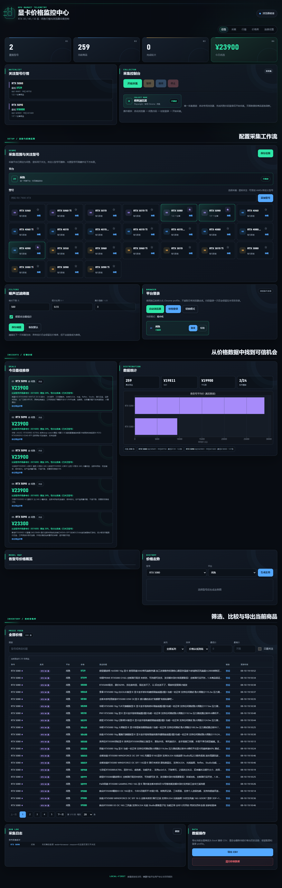
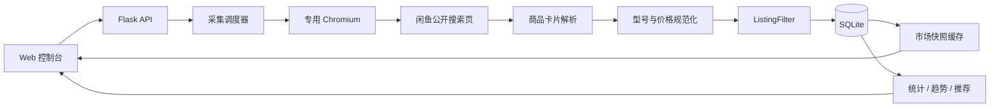
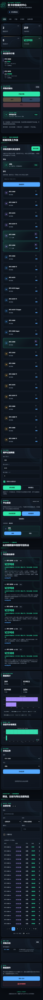

<div align="center">

# GPU Price Monitor

### 把闲鱼的价格噪声，整理成可验证的市场信号

一个面向个人研究的 GPU 价格观察台：用真实浏览器访问闲鱼公开搜索结果，识别型号、过滤噪声、记录每日价格，并把结果沉淀成趋势、分布和推荐。

<p>
  <strong>Playwright</strong>&nbsp; · &nbsp;<strong>Flask</strong>&nbsp; · &nbsp;<strong>SQLite</strong>&nbsp; · &nbsp;<strong>Matplotlib</strong>
</p>

<p>
  <a href="https://github.com/fjy566/gpu-price-monitor">项目主页</a>
  ·
  <a href="https://github.com/fjy566/gpu-price-monitor/issues">问题反馈</a>
</p>

</div>

<p align="center">
  
</p>

> 这是一个本地运行的价格观察工具，不是交易平台，也不承诺商品真实性。请遵守闲鱼用户协议、robots 规则和适用法律，不要绕过验证码、登录验证、访问控制或平台风控。

## 这是什么

在二手市场里，真正有价值的不是“搜到一个最低价”，而是知道这个价格是否属于正确型号、是否是完整商品、是否可能是引流或故障描述，以及它在一段时间内如何变化。

GPU Price Monitor 将这件事拆成一条清晰的流水线：

```text
浏览器采集 → 型号识别 → 商品过滤 → 批量入库 → 统计分析 → 趋势与推荐
```

当前主流程只使用“模拟浏览器”采集闲鱼，避免前端显示的采集方式、登录状态和实际执行路径不一致。

## 能做什么

| 采集 | 识别 | 分析 |
| --- | --- | --- |
| 使用独立 Chromium 访问闲鱼 | 精确区分基础款、Ti、Super 和 V2 | 最低价、平均价、中位数 |
| 模拟滚动与分页读取商品卡片 | 支持 RTX 5090 / 5090 D / 5090 D V2 | 单日箱型图与散点图 |
| 每个型号一轮只采集一次 | 支持自定义型号 | 多日价格趋势 |
| 每页结果批量写入数据库 | 内置型号可隐藏/恢复 | 低价推荐与可信度惩罚 |
| 采集结束自动退出浏览器 | 自定义型号可添加/删除 | CSV 导出和实时日志 |

### 重点过滤

程序会在写入数据库前过滤明显不适合做市场比较的条目，包括：

- “仅包装、支架、散热器、配件”等非显卡商品
- 维修卡、坏卡、拆机卡、矿卡、工程样品
- 与目标型号不匹配的基础款、Ti/Super/V2 混淆标题
- 明显低于同型号市场基准的引流价
- 价格格式异常、分期月供或优惠金额被误识别的条目

过滤是数据清洗，不是商品鉴定。打开原始链接核验成色、保修、配件和卖家描述仍然是必要步骤。

## 3 分钟开始使用

### 1. 安装

Windows PowerShell：

```powershell
cd F:\source\Python\gpu-price-monitor
python -m venv .venv
.\.venv\Scripts\Activate.ps1
python -m pip install -r requirements.txt
playwright install chromium
```

### 2. 启动

```powershell
python app.py
```

然后打开 [http://127.0.0.1:5000](http://127.0.0.1:5000)。如需换端口：

```powershell
$env:GPU_MONITOR_PORT = "5001"
python app.py
```

请使用 `python app.py` 启动。采集器使用 Playwright 同步 API，使用 `flask run` 或把应用放进异步事件循环，可能触发：

```text
It looks like you are using Playwright Sync API inside the asyncio loop
```

### 3. 登录并采集

1. 在控制台点击“闲鱼登录”。
2. 在项目专用浏览器中用手机扫码。
3. 点击“校验登录”，确认状态为已登录。
4. 选择型号，设置关注项和过滤阈值。
5. 点击“开始采集”，等待本轮完成。

一次开始操作只采集一轮：每个型号处理一次，完成后浏览器自动关闭；下一次采集需要再次点击开始。

## 采集流程



浏览器采集使用项目专用 profile，与日常 Chrome 隔离：

```text
.sessions/        闲鱼登录会话
.chrome_profile/  Chromium 用户数据、Cookie 和缓存
```

这两个目录包含登录态，不要提交到 Git，也不要复制给他人。

## 数据如何记录

### 当前价格：看“现在”

`prices` 表按商品 URL 保存最新状态。同一个商品再次出现时更新价格、标题和时间，不重复创建当前商品。

### 每日历史：看“变化”

`price_history` 表按商品和自然日保存快照：

| 情况 | 处理方式 |
| --- | --- |
| 同一天采集两次 | 更新当天快照，保留当天最后一次采样 |
| 第二天再次采集 | 新增第二天快照，前一天历史继续保留 |
| 新商品 URL | 写入当前价格，并新增当天历史 |
| 同 URL 价格不变 | 仍可形成当天的观察快照 |

因此：价格列表展示最新状态，趋势图使用按日历史，推荐算法使用当前市场快照。

## 5090 型号识别

为了避免基础型号和特殊版本互相污染，标题会先做空格、大小写和标点规范化，再按变体优先级匹配：

```text
RTX 5090 D V2   ← 最高优先级
RTX 5090 D
RTX 5090        ← 基础型号
```

以下写法会归入同一个 V2 变体：

```text
5090D V2
5090 D V2
5090DV2
5090 D V2版
```

同样的“精确匹配优先”规则也适用于 Ti、Super 等型号，避免 `RTX 5070 Ti` 被错误归入 `RTX 5070`。

## 控制台区域

| 区域 | 用途 |
| --- | --- |
| 运行状态 | 浏览器状态、当前型号、进度、已采集数量 |
| 型号管理 | 添加/删除自定义型号，隐藏/恢复内置型号 |
| 闲鱼登录 | 打开登录页、扫码和校验登录态 |
| 采集控制 | 开始、暂停、恢复、停止本轮采集 |
| 价格概览 | 最低价、平均价、中位数和市场覆盖 |
| 趋势分析 | 单日分布、多日走势和型号对比 |
| 商品列表 | 搜索、筛选、排序和原始商品链接 |
| 推荐区域 | 基于市场基准的低价候选 |
| 采集日志 | 实时查看成功、过滤、无数据和异常原因 |

移动端会把表格放进独立滚动区域，桌面端使用卡片式深色玻璃布局。

<table>
  <tr>
    <td></td>
    <td></td>
  </tr>
</table>

## 项目结构

```text
gpu-price-monitor/
├── app.py                  # Flask 入口、页面和 Web API
├── crawler.py              # 浏览器生命周期、队列和闲鱼采集
├── database.py             # SQLite、当前价格、每日历史和批量事务
├── gpus.py                 # 型号目录、精确匹配和型号管理
├── listing_pipeline.py     # 商品过滤流水线
├── market_data.py          # 市场快照和 revision 缓存
├── settings_store.py       # 设置校验、持久化和缓存
├── charts.py               # 趋势图、分布图和图表缓存
├── recommend.py            # 市场基准和低价推荐
├── http_crawler.py         # 备用 HTTP 解析器
├── api_panel.py            # 备用平台 API 兼容层
├── templates/index.html    # 页面模板
├── static/app.js           # 前端交互和增量刷新
├── static/style.css        # 统一视觉和响应式布局
├── static/charts/          # 运行时生成的图表
├── tests/                  # 自动化测试
├── docs/plans/             # 设计与审查文档
├── requirements.txt        # Python 依赖
└── prices.db               # 本地 SQLite 数据库（运行后生成）
```

### 模块关系

```text
app.py
 ├─ crawler.py ─────── Playwright / GoofishCrawler
 ├─ listing_pipeline.py ─ 商品过滤
 ├─ database.py ────── prices / price_history / states
 ├─ market_data.py ─── 快照缓存
 ├─ charts.py ──────── Matplotlib 图表
 ├─ recommend.py ───── 低价推荐
 ├─ gpus.py ────────── 型号目录
 └─ settings_store.py ─ 配置缓存
```

## API 速览

| 接口 | 作用 |
| --- | --- |
| `GET /` | 打开控制台 |
| `POST /api/control/start` | 启动专用浏览器 |
| `POST /api/control/start_crawl` | 开始一轮采集 |
| `POST /api/control/pause` / `resume` | 暂停 / 恢复 |
| `POST /api/control/stop` | 停止并关闭浏览器 |
| `GET /api/status` | 运行状态和采集进度 |
| `GET /api/prices` | 当前价格，支持 `since=<revision>` 增量刷新 |
| `GET /api/history` | 商品历史价格 |
| `GET /api/trend` | 型号趋势数据 |
| `GET /api/stats` | 统计数据和概览图 |
| `GET /api/series_chart` | 趋势图 |
| `GET /api/recommend` | 低价推荐 |
| `GET /api/log` | 采集日志 |
| `GET/POST/PATCH/DELETE /api/models` | 型号查询、添加、隐藏、恢复和删除 |
| `GET/POST /api/settings` | 采集和过滤设置 |
| `GET /api/export` | CSV 导出 |
| `POST /api/clear` | 清理当前价格与历史数据 |

## 性能设计

项目把“浏览器采集的慢”和“管理台查询的频繁”分开处理：

- SQLite 开启 WAL，降低读写互相阻塞。
- 商品按页面批量写入，减少事务提交和连接开销。
- 型号、设置和市场统计使用缓存。
- 通过 `catalog_revision` 判断数据是否变化。
- 前端轮询时，数据没变化只返回 `unchanged`，不重复传输完整列表。
- 图表按数据库、平台、型号和数据版本缓存。
- 采集任务使用阻塞队列，避免空轮询消耗 CPU。

## 测试与检查

运行完整测试：

```powershell
python -m unittest discover -s tests -v
```

运行静态检查：

```powershell
python -m py_compile app.py crawler.py database.py gpus.py http_crawler.py charts.py recommend.py listing_pipeline.py market_data.py settings_store.py
node --check static/app.js
git diff --check
```

## 常见问题

### 开始采集提示没有登录

先点击“闲鱼登录”，扫码后再点击“校验登录”。登录态保存在项目专用 profile 中，不等同于日常 Chrome 的登录态。

### 日志显示页面打开失败

依次检查：

1. 专用浏览器是否能正常打开闲鱼首页。
2. 是否出现登录过期、滑块、验证码或访问验证。
3. 网络是否能稳定访问闲鱼。
4. 目标型号是否真的出现在当前搜索结果。
5. 是否被过滤规则判定为低价引流或非目标商品。

不要通过提高访问频率或绕过验证来处理风控问题；应停止采集，检查登录和页面状态后再重试。

### 为什么同一天两次采集只有一条历史

这是按日快照设计的结果：同一商品当天只保留最后一次观察，避免一天内重复采样把某一天的权重放大。若需要保留每次采集批次，应另建批次明细表，而不是污染每日趋势数据。

### 图表没有点

图表依赖 `price_history`。第一次采集后会形成当天快照；数据量过少时显示箱型/散点分布，跨多天后才显示连续趋势。

## 本地文件与隐私

以下文件包含运行状态、登录信息或生成内容，通常不应提交：

```text
.sessions/
.chrome_profile/
prices.db
__pycache__/
server*.log
flask*.log
```

升级或清理数据前，可以先复制 `prices.db` 做备份。不要把 `.sessions/` 或 `.chrome_profile/` 上传到公共仓库。

## 合规边界

本项目只面向个人学习、研究和价格观察：

- 仅访问你有权访问的公开页面和登录会话。
- 尊重平台服务条款、robots 规则、频率限制和访问提示。
- 不实现验证码破解、指纹伪造、代理轮换、账号批量化或访问控制绕过。
- 采集结果仅作为辅助信息，交易前必须自行核验。

仓库当前未声明开源许可证。除非项目所有者另行授权，请不要将代码或采集结果用于商业分发。

<div align="center">

**让每一次采集都留下可解释的证据。**

</div>
